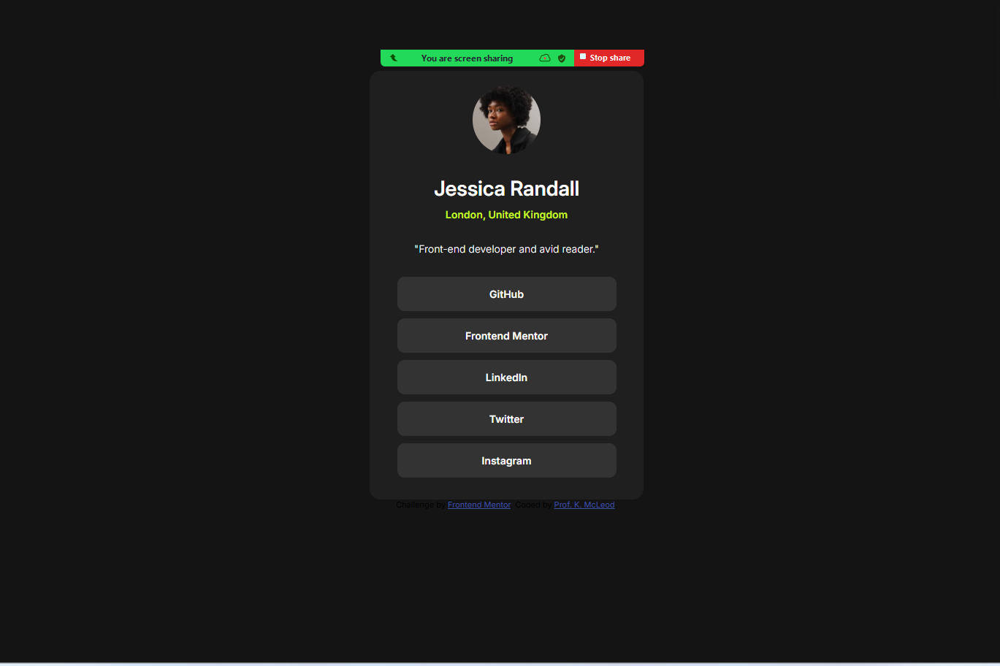
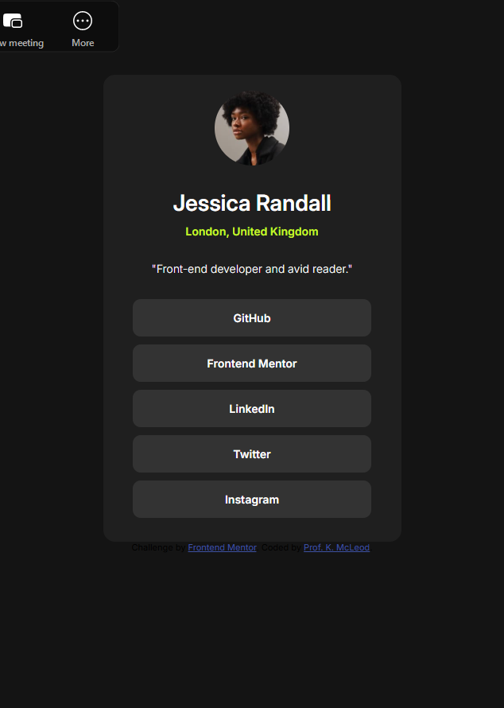

# Frontend Mentor - Social links profile solution

This is a solution to the [Social links profile challenge on Frontend Mentor](https://www.frontendmentor.io/challenges/social-links-profile-UG32l9m6dQ). Frontend Mentor challenges help you improve your coding skills by building realistic projects. 

## Table of contents

- [Overview](#overview)
  - [The challenge](#the-challenge)
  - [Screenshot](#screenshot)
  - [Links](#links)
- [My process](#my-process)
  - [Built with](#built-with)
  - [What I learned](#what-i-learned)
  - [Continued development](#continued-development)
- [Author](#author)
- [Acknowledgments](#acknowledgments)

## Overview

### The challenge

Users should be able to:

- See hover and focus states for all interactive elements on the page

### Screenshot

### Links

- [Solution URL:](https://www.frontendmentor.io/solutions/social-links-profile-main-fpBJvLdSyU)
- [Live Site URL:](https://profkmcleod25.github.io/social-links-profile-main/)

## My process

### Built with

- Semantic HTML5 markup
- CSS custom variables
- Mobile-first workflow

### What I learned

While completing this project, I learned a more details regarding use cases for HTML buttons versus hyperlinks. Through the challenge feedback, there were also great recommendations pertaining to alternative ways to approach the CSS.

### Continued development

The focus options will need to be explored more deeply.

## Author

- Frontend Mentor - [@profkmcleod25](https://www.frontendmentor.io/profile/profkmcleod25)

## Acknowledgments

I would like to acknowledge all aspiring web designers who particpated in the mob coding exercise.
